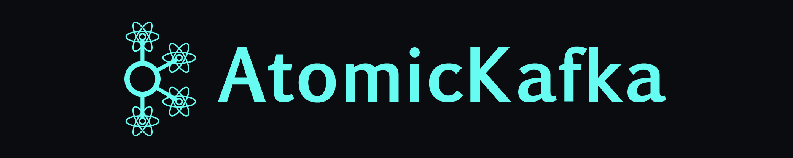
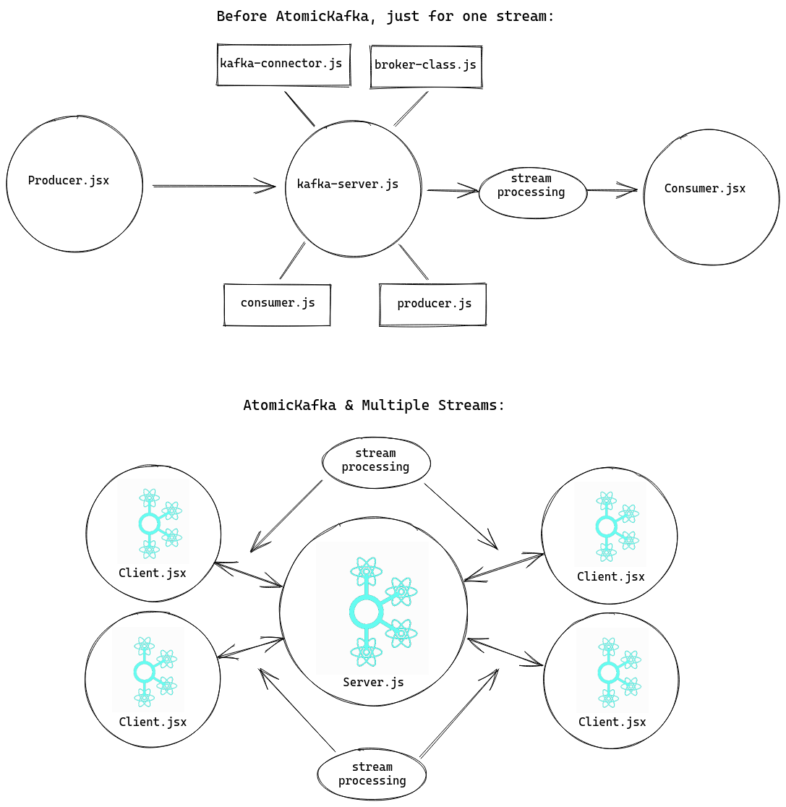

___


<p align="center">AtomicKafka is a lightweight <a href="https://www.npmjs.com/package/atomic-kafka"> NPM Package</a> developed to simplify the process of establishing bidirectional, real-time data streaming with Apache Kafka in your web-app.
<br>
<a href="http://www.atomickafka.com/">Website</a><span>&nbsp; | &nbsp;</span><a href="https://github.com/oslabs-beta/AtomicKafka">Library</a><span>&nbsp; | &nbsp;</span><a href="https://github.com/AtomicKafka">Demo Apps</a><span>&nbsp; | &nbsp;</span><a href="https://medium.com/@dbehmoaras/2eb79b20eaae?source=friends_link&sk=843b83b81eb79f37f0d2b8a96ce26212">Featured on Medium</a></p>


<p align="center">

  <a href="https://www.npmjs.com/package/atomic-kafka">
    
  </a>
  <a href="https://github.com/oslabs-beta/atomickafka/graphs/contributors">
    
  </a>
  <a id="star" href="https://github.com/oslabs-beta/AtomicKafka/stargazers">
    
  </a>
  <a href="https://github.com/oslabs-beta/atomickafka/blob/main/LICENSE">
    
  </a>
  <a href="https://github.com/oslabs-beta/atomickafka/blob/main/LICENSE">
    
  </a>
</p>

___

**<h2 id="">Table of Contents</h2>**
1. [Features](#features)
2. [Benefits of AtomicKafka](#ben)
3. [Getting Started](#gs)
4. [Contribution](#contribution)
5. [Maintainers](#maintainers)
6. [Built With](#dependencies)
7. [License](#license)
___
**<h2 id="features">Features</h2>**

- Websocket connections between the client and the server that accept user-defined event strings and callbacks
- Broker initialization and connection to Apache Kafka
- Consumer and Producer classes are predefined to be as modular as possible
- Consumer functions accept user-defined callback functions to support lightweight stream processing
- React Hook that throttles the websocket event listener with a time interval to maintain client performance
- Supports multiple Kafka streams
___
**<h2 id="ben">Benefits of AtomicKafka</h2>**


___

**<h2 id="gs">Getting Started</h2>**

### **1. Initialize Kafka cluster**

Atomic Kafka currently supports running Apache Kafka clusters either using a Docker image or by connecting to Confluent Cloud.


**Docker:**
- Download this [.yml](https://github.com/AtomicKafka/atomicKafkaConsumer/blob/main/docker-compose.yml) and run the following command in your terminal:
  ```
  docker-compose up -d
  ```

**Confluent Cloud:**
- Follow the steps on [Confluent Cloud](https://www.confluent.io/confluent-cloud/) to create a free account with Confluent cloud. Obtain the ***API_ACCESS_KEY***, **_API_ACCESS_SECRET_**, and ***BOOTSTRAP_SERVER***

___
### **2. Configure *.env* file**
Include the following lines in your .env depending on your Kafka environment. Set the PORT variable to the port where **AtomicKafkaServer** will be initialized in the next step.

- Docker .env config: (***API_KEY*** and ***API_SECRET*** are intentionally left blank)
  ```js
  PORT=<USER_DEFINED>
  API_KEY=
  API_SECRET=
  KAFKA_BOOTSTRAP_SERVER=localhost:9092
  ```
- Confluent Cloud .env config: (***PORT*** intentionally left blank)
  ```js
  PORT=<USER_DEFINED>
  API_KEY=<API_ACCESS_KEY>
  API_SECRET=<API_ACCESS_SECRET>
  KAFKA_BOOTSTRAP_SERVER=<BOOTSTRAP_SERVER>
  ```
___
### **3. Install AtomicKafka**

```sh
$ npm install atomic-kafka
```
___
### **4. Create Server Instance**
Initialize a server instance of your choice (HTTP, Node.js, etc). The example below contemplates a Node.js Express server.

***ATTENTION: a Server instance must be created for every remote Atomic Kafka Client.***
1. Initialize and configure ***expressApp*** according to desired specifications.
2. Require in ***AtomicKafkaServer***.
3. Define a ***server*** that listens on the user-defined PORT environment variable.
4. Initialize an AtomicKafkaServer instance ***aks*** by passing in the ***server***.
```js
/* initialize and configure Node.js expressApp according to user specifications
then add the following: */

const AtomicKafkaServer = require('atomic-kafka/server');

const server = expressApp.listen(process.env.PORT, () => {
  console.log(`Listening on port ${process.env.PORT}`);
})

const aks = new AtomicKafkaServer(server);
```
___
### **5A. Create the Consumer and enable the built-in websocket on the server**
1. Initialize a **_newConsumer_** on the **_aks_** instance and pass in the **_group_ID_string_**.
2. Enable the built-in websocket by invoking **_socketConsume_** and passing in the **_group_ID_string_**, an **_event_string_**, and the **_topic_string_**.

```js
/* AKS_Producer_Init */
aks.newProducer('topic');
aks.globalProduce('produceMessageEvent', 'topic');
```

___
### **5B. Create the Producer and enable the built-in websocket on the server**
1. Initialize a ***newProducer*** on the ***aks*** instance and pass in the ***topic_string***.
2. Enable the built-in websocket by invoking ***globalProducer*** and passing in an ***event_string*** and the ***topic_string***.
```js
/* AKS_Consumer_Init */
aks.newConsumer('group_ID');
aks.socketConsume('group_ID', 'consumeMessageEvent', 'topic');
```
___
### **6A. JavaScript - Import Client Interface (React & Hooks)**
```js
/* in your React.jsx Component */
import AtomicKafkaClient from 'atomic-kafka/client';
```
### **6B. TypeScript - Import Client Interface (React & Hooks)**
```js
/* in your TypeScript React Component */
declare function require(name:string);
const AtomicKafkaClient = require('atomic-kafka/client').default;

```
___
### **7A. Create and implement Consumer client component (JS & TS)**
  1. Initialize ***akc*** as an ***AtomicKafkaClient***. Pass in ***AtomicKafkaServer*** instance host's ***URI_STRING***
  2. Define a callback to process message ***payload*** through the React state management tool of your choice.
  3. Implement ***useInterval*** to consume from the kafka cluster on interval.
  4. Return the invocation of the ***consumer*** function on the ***akc*** instance. Pass in a user-defined websocket ***event_string***, the previously defined ***callback***, and the ***interval_delay*** in milliseconds.
```js
function ConsumerComponent() {
  const akc = new AtomicKafkaClient('ATOMIC_KAFKA_SERVER_URI_STRING');

  const callback = (payload) => {
    /* user-provided data stream processing function definition
    that effects state change */
  }

  /* Throttles message consumption. Interval in milliseconds,
  can be any number */
  akc.useInterval(() => akc.consumer('consumeMessageEvent', callback), 4000);
}
```

### **7B. Create and implement Producer client component (JS & TS)**

1. Initialize **_akc_** as an **_AtomicKafkaClient_**. Pass in **_AtomicKafkaServer_** instance host's **_URI_STRING_**
2. Generate a ***payload*** formatted as an arbitrarily-nested JSON object. The example below defines a payload, but it can be generated at any point in the client according to the user's specification.
3. Invoke the consumer function. Pass in the websocket ***event_string*** and the ***payload***.

```js
function ProducerComponent() {
  const akc = new AtomicKafkaClient('ATOMIC_KAFKA_SERVER_URI_STRING');

  const payload = {
    /* Data to be sent to the cluster. Arbitrarily-nested JSON format.
    Can be defined anywhere in the app. */
  }

  akc.producer('produceMessageEvent', payload);
}
```
___
**<h2 id="contribution">Contribute</h2>**
We want this open-sourced project to continue to improve. If you would like to make a contribution to AtomicKafka, please fork [this repo](https://github.com/oslabs-beta/AtomicKafka), add your awesome changes to a well-named feature branch of this repository, and make a pull request. We look forward to your input! And if you want to support AtomicKafka, please click on the ⭐(https://github.com/oslabs-beta/AtomicKafka/stargazers) button for us! 
___
**<h2 id="maintainers">Maintainers</h2>**
[Nikhil Massand](https://github.com/nikhilmassand)

[Vicki Yang](https://github.com/vickiwyang)

[David Behmoaras](https://github.com/dbehmoaras)

[Joseph Lee](https://github.com/amplifygospel)

___
**<h2 id="dependencies">Built With</h2>**

- [KafkaJS](https://kafka.js.org/)
- [React](https://reactjs.org/)
- [TypeScript](https://www.typescriptlang.org/)
- [Socket-IO](https://socket.io/)
- [dotenv](https://github.com/motdotla/dotenv#readme)
- The support of [OSLabs](https://opensourcelabs.io/)

___
## <h2 id="license">License</h2>
This product is released under the MIT License
